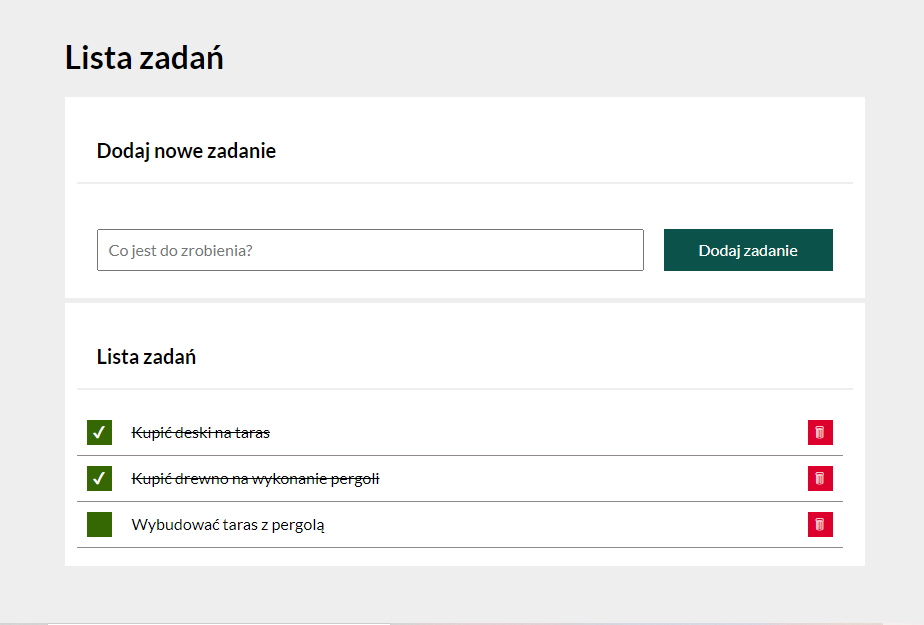

# To-do list

https://fiat126p.github.io/To-do-list/

## Application description
It is an application that allows you to create a to-do list, shopping list or any other kind of list.
The application allows us to add new activities, mark completed tasks. In case of completion, it is also possible to delete the unnecessary task.

#### Building an application.
Are included in the application:
1.A field for entering activities, items from the list.
2.Button for adding items to the list.
3.The section where the new items in the list appear- after adding a new item from the list, two buttons will also appear in this place: one for deselecting completed items, the other for deleting them.